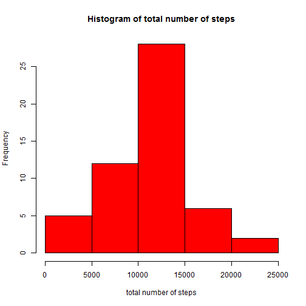
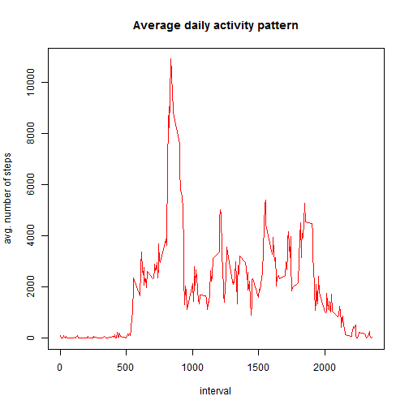
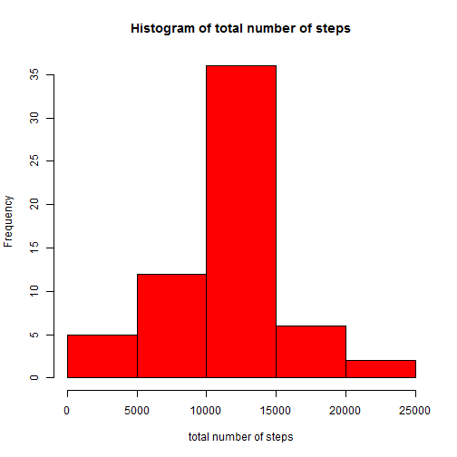
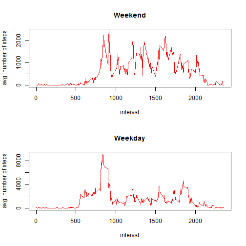

# Reproducible Research: Peer Assessment 1


## Loading and preprocessing the data

```r
# read.csv to load the data
data <- read.csv("activity.csv", colClasses = c("numeric", "character", "numeric"))
```


## What is mean total number of steps taken per day?

```r
# ploting histogram, calculating mean and median
agg <- aggregate(data$steps, by = list(data$date), sum)
hist(agg$x, col = "red", xlab = "total number of steps", main = "Histogram of total number of steps")
```

 

```r
cat("Mean =", as.character(mean(agg$x, na.rm = T)))
```

```
## Mean = 10766.1886792453
```

```r
cat("Mean =", median(agg$x, na.rm = T))
```

```
## Mean = 10765
```


## What is the average daily activity pattern?

```r
# aggragate by interval, and plot the result
agg <- aggregate(data$steps, by = list(data$interval), function(x) sum(x, na.rm = T))
plot(agg$Group.1, agg$x, type = "l", xlab = "interval", ylab = "avg. number of steps", 
    col = "red", main = "Average daily activity pattern")
```

 

```r
cat("Max Interval =", agg[order(agg$x, decreasing = T), ][1, 1])
```

```
## Max Interval = 835
```


## Imputing missing values

```r
cat("total number of NA =", sum(is.na(data$steps)))
```

```
## total number of NA = 2304
```

```r

# For function 'ddply'' in library plyr
library(plyr)
```

```
## Warning: package 'plyr' was built under R version 3.0.3
```

```r
# define imputing function, and applying the imputing function on data group
# by interval
impute <- function(x) ifelse(is.na(x), mean(x, na.rm = TRUE), x)
# assigning imputed date to 'data2'
data2 <- ddply(data, ~interval, transform, steps = impute(steps))
# ploting histogram, calculating mean and median
agg <- aggregate(data2$steps, by = list(data2$date), sum)
hist(agg$x, col = "red", xlab = "total number of steps", main = "Histogram of total number of steps")
```

 

```r
cat("Mean =", as.character(mean(agg$x, na.rm = T)))
```

```
## Mean = 10766.1886792453
```

```r
cat("Mean =", median(agg$x, na.rm = T))
```

```
## Mean = 10766
```


## Are there differences in activity patterns between weekdays and weekends?

```r
# create a new factor indicates weekend note that c('Saturday' ,'Sunday' )
# is depends on your system language
data$weekend <- weekdays(as.Date(data$date, "%Y-%m-%d")) %in% c("Saturday", 
    "Sunday")

# converting to weekday, weekend factor
data$weekend <- as.factor(ifelse(data$weekend, "weekend", "weekday"))

# split data by weekend/weekday
data_split <- split(data, data$weekend)
data_weekend <- data_split[["weekend"]]
data_weekday <- data_split[["weekday"]]

# ploting each subset by base graphics system
par(mfrow = c(2, 1))
agg <- aggregate(data_weekend$steps, by = list(data_weekend$interval), function(x) sum(x, 
    na.rm = T))
plot(agg$Group.1, agg$x, type = "l", xlab = "interval", ylab = "avg. number of steps", 
    col = "red", main = "Weekend")
agg <- aggregate(data_weekday$steps, by = list(data_weekday$interval), function(x) sum(x, 
    na.rm = T))
plot(agg$Group.1, agg$x, type = "l", xlab = "interval", ylab = "avg. number of steps", 
    col = "red", main = "Weekday")
```

 

```r

```

